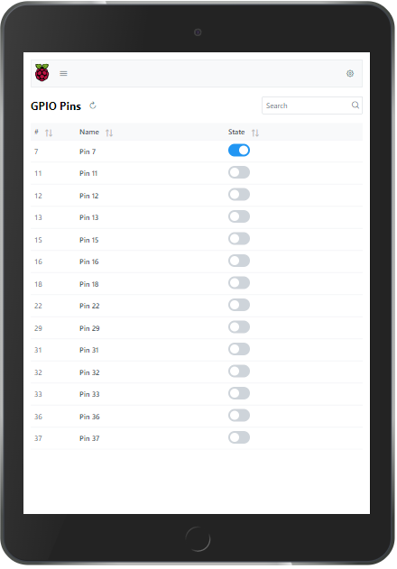
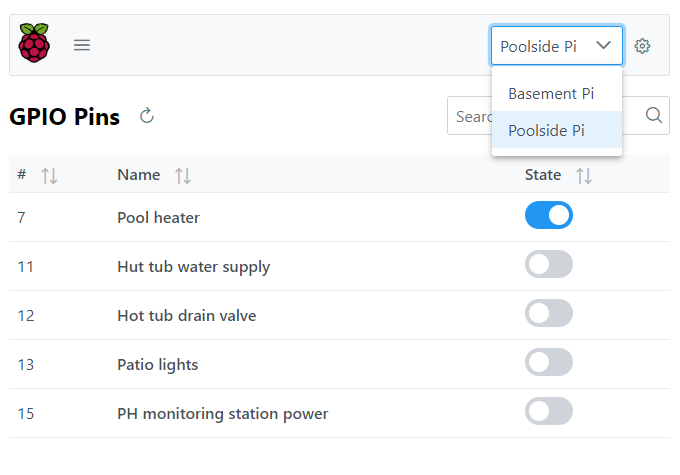

# 🥧 Raspberry Pi Client

A simple UI to control Raspberry Pi GPIO pins. The `raspberry-pi-client` is a decoupled frontend SPA application designed to communicate with the [raspberry-pi-server project](https://github.com/rustygreen/raspberry-pi-server).

## 🏁 Getting Started

There are several ways to run the `raspberry-pi-client` application. You can use [Docker](https://www.docker.com/), build it manually and deploy as a static site, or deploy it through [Kubernetes](https://kubernetes.io/).

The first step is to deploy the [raspberry-pi-server](https://github.com/rustygreen/raspberry-pi-server) to your Raspberry Pi. You will then configure the URL from the Raspberry Pi Server into the client (so it knows where to connect to the server).




### Run with Docker

```bash
docker run -d --restart=unless-stopped -p 80:80 ghcr.io/rustygreen/raspberry-pi-client:main
```

To access the application UI, open a browser and go to the hostname or address where the container was installed.

### Using Docker Compose

docker-compose.yml

```yaml
version: '2'
services:
  frontend:
    image: ghcr.io/rustygreen/raspberry-pi-client:main
    ports:
      - '80:80'
    environment:
      # The configuration will consist of one server with URL/title:
      - 'RPC_SERVER=https://pi-basement.rusty.green'
      - 'RPC_SERVER_TITLE=Basement Pi'
```

Then run `docker-compose up`

See the [docker-compose docs](./docs/docker-compose.md) for more examples.

### Kubernetes

deployment.yml

```yaml
apiVersion: apps/v1
kind: Deployment
metadata:
  name: raspberry-pi-client
spec:
  selector:
    matchLabels:
      app: raspberry-pi-client
  replicas: 2
  template:
    metadata:
      labels:
        app: raspberry-pi-client
    spec:
      containers:
        - name: raspberry-pi-client
          image: ghcr.io/rustygreen/raspberry-pi-client:main
          env:
            - name: RPC_SERVER
              value: https://pi-basement.rusty.green
            - name: RPC_SERVER_TITLE
              value: Basement Pi
          ports:
            - containerPort: 80
```

Then run `docker-compose up`

See the [docker-compose docs](./docs/docker-compose.md) for more examples.

### Run or Build Manually

#### Dependencies

- NodeJS 14+
- Git

#### Clone and install dependencies

```bash
git clone https://github.com/rustygreen/raspberry-pi-client
cd raspberry-pi-client
npm install
```

#### Run in development

```bash
npm run start
# Go to http://localhost:4200
```

The server(s) will be "mocked" by default. Modify the `assets/config.json` file to point to real (or different) Raspberry Pi server(s).

#### Build production static site

```bash
npm run build:prod # Build production build
# Deploy: dist/raspberry-pi-client
```

## Configuration

The application is configurable by changing the `assets/config.json` file. This config file can be manually changed before building the application (`npm run build:prod`) or after building the application (modify: `dist/raspberry-pi-client/assets/config.json`).

If you are running the application through Docker or Kubernetes, then you can pass configuration via environment variables. The `config.json` file will be created at container startup time.

#### Environment Variables

_All environment variables are optional_

| Variable         | Description                                                                             | Example                                                     |
| ---------------- | --------------------------------------------------------------------------------------- | ----------------------------------------------------------- |
| RPC_SERVER       | The URL to the [raspberry-pi-server](https://github.com/rustygreen/raspberry-pi-server) | https://your-pi-server                                      |
| RPC_SERVER_TITLE | The title for your Raspberry Pi Server                                                  | Basement Pi                                                 |
| RPC_CONFIG       | The full JSON configuration to apply (see `assets/config.json`)                         | `{"servers": [{"url": "https://pi-basement.rusty.green"}]}` |

## TODOs

- [x] Add CI/CD
- [ ] Finish documentation
- [ ] Add unit tests
- [ ] Add sample app
- [ ] Add recipes functionality
- [ ] Add ability to set server details within app UI
